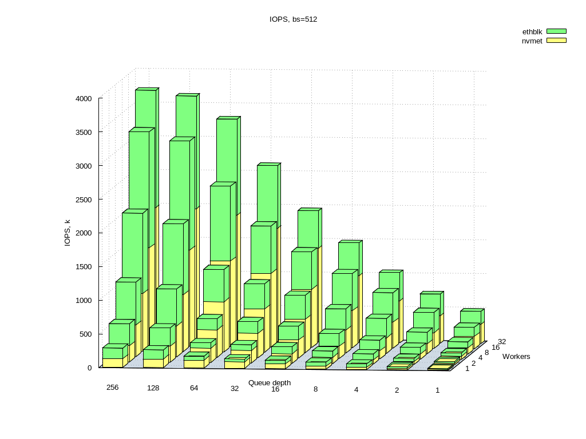
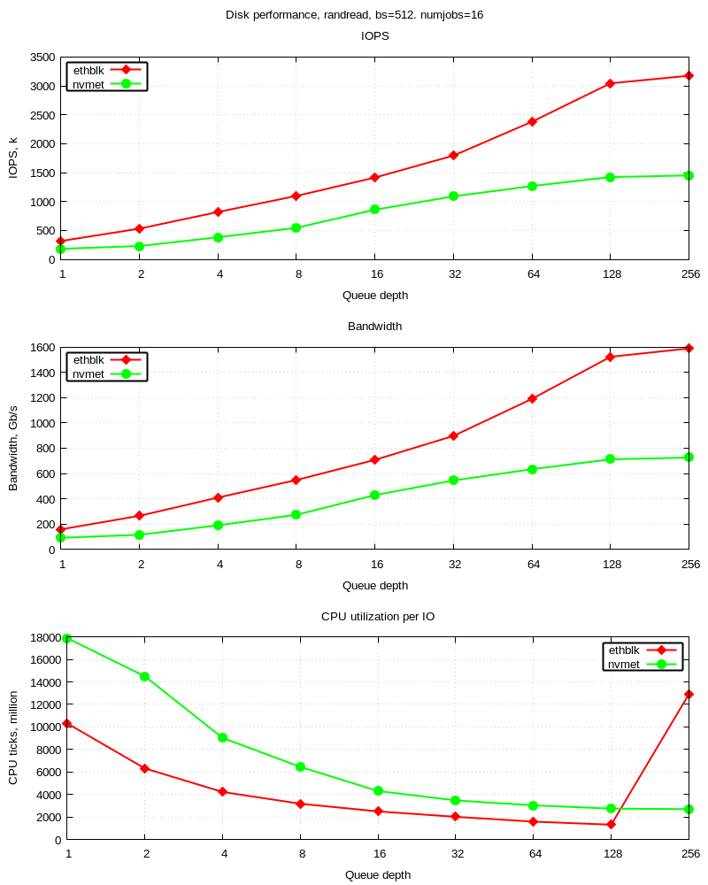

# ETHBLK - high-performance disk over L2/L3 network protocol

Ethblk got its aspiration in AOE - ATA-over-Ethernet. It does not
support ATA, but can send disk blocks over Ethernet in a highly
efficient manner. It was designed not to repeat locking, false cache
sharing and serialization problems found in AOE implementation.

Ethblk runs entirely in kernel mode, supports both target and
initiator modes.

The work is still in progress, expect to see a lot of kernel crashes
and freezes, missing/incomplete/wrong documentation and frequent API
changes. Bug reports and all kinds of suggestions are more than
welcome!

For setup look at scripts/ethblk-setup. These variables need to be
changed according to your configuration:

```
nic=enp1s0
ini=1
tgt=0
tgt_ip=192.168.51.1
tgt_disk=/dev/nvme0n1
ini_ip=192.168.51.51
ini_mac=50:6b:4b:cc:f3:e6
```

By default, all messages above debug level are logged. For debug do
next:

`echo module ethblk +p | sudo tee /sys/kernel/debug/dynamic_debug/control`

Ethblk is a Linux-only thing as of now.

### Brief performance comparison of local disk vs NVMe-over-TCP vs ethblk:

tl;dr: ethblk is faster than NVMe-over-TCP and consumes less CPU per IO all at the same time!

(see perf-runs for full details)




##### Native NVMe on target (AMD EPYC 7281, LVM striped over 4x Samsung EVO 970 Plus):
```
fio --filename=/dev/mapper/vg_nvme-bar --rw=randread --direct=1  --bs=4k --iodepth=128 --numjobs=16 --ioengine=io_uring --fixedbufs --name=foo --time_based --runtime=60 --group_reporting
  read: IOPS=2833k, BW=10.8GiB/s (11.6GB/s)(648GiB/60001msec)
    slat (usec): min=2, max=1341, avg= 4.20, stdev= 2.45
    clat (usec): min=12, max=7801, avg=717.47, stdev=49.50
     lat (usec): min=15, max=7805, avg=721.88, stdev=49.75
```
##### NVMe-over-TCP on initator (AMD EPYC 7302P, 100 GbE Mellanox MT27800):
```
fio --filename=/dev/nvme0n1 --rw=randread --direct=1  --bs=4k --iodepth=128 --numjobs=16 --ioengine=io_uring --fixedbufs --name=foo --time_based --runtime=60 --group_reporting
  read: IOPS=1120k, BW=4374MiB/s (4586MB/s)(256GiB/60003msec)
    slat (nsec): min=1280, max=13852k, avg=11840.16, stdev=26949.08
    clat (usec): min=9, max=24682, avg=1815.50, stdev=788.41
     lat (usec): min=62, max=24685, avg=1827.57, stdev=789.07
```
##### NVMe over ethblk on initiator (AMD EPYC 7302P, 100 GbE Mellanox MT27800):
```
fio --filename=/dev/eda0 --rw=randread --direct=1  --bs=4k --iodepth=128 --numjobs=16 --ioengine=io_uring --fixedbufs --name=foo --time_based --runtime=60 --group_reporting
  read: IOPS=1736k, BW=6782MiB/s (7111MB/s)(397GiB/60001msec)
    slat (nsec): min=1350, max=11201k, avg=6048.24, stdev=24779.02
    clat (nsec): min=130, max=22722k, avg=1172453.37, stdev=731551.82
     lat (usec): min=38, max=22725, avg=1178.67, stdev=735.25
```
